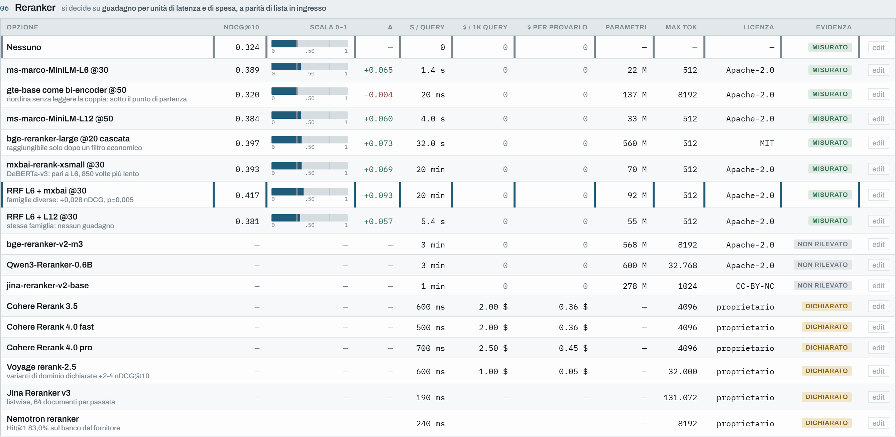

# Scegliere un sistema di ricerca con i dati

Studio su come scegliere e motivare i componenti di un sistema RAG (ricerca di brani su documenti finanziari e risposta di un modello). Il prodotto principale è il metodo, non il punteggio: un **banco delle decisioni**, una pagina HTML senza server in cui ogni componente (unità di indicizzazione, modello di embedding, ricerca, riordinatore, generatore) ha la sua tabella di alternative, e i vincoli del contesto (dati riservati, budget zero, meno di un secondo per domanda, solo CPU, alto volume) si attivano come filtri che escludono le opzioni incompatibili. Ogni valore dichiara se è misurato qui, dichiarato da un fornitore o non rilevato.

**Banco online:** https://rag-decision-lab-banco.vercel.app · alimentato da un esperimento reale su recupero, generazione e un agente minimo (modelli gratuiti, su CPU: i valori assoluti sono modesti, il valore sta nel come sono state confrontate le alternative).



## Come ragiona il banco

- **Un criterio diverso per ogni decisione.** L'unità di indicizzazione non si sceglie guardando il nDCG, che dipende da tutta la pipeline a valle, ma da quante unità produce l'indice e quante risposte restano spezzate; il modello di embedding da qualità, costo e dimensione dell'indice. La prima versione, con una griglia uniforme, è stata scartata.
- **Il contesto decide.** Con «dati riservati» e «budget zero» attivi, delle quattordici righe del modulo riordinatore ne restano otto. Con dati non riservati e un budget tornano in gioco servizi commerciali come Cohere Rerank, registrato con il prezzo (2 $ per mille interrogazioni) e come non provato.
- **I buchi restano buchi.** Solo i valori misurati qui possono essere evidenziati come scelta migliore; quelli non rilevati restano vuoti. Nella prima versione un numero preso da una classifica pubblica compariva sopra le opzioni provate davvero.

## Provare

```bash
uv sync                                   # Python 3.14; per la generazione: uv sync --extra generazione
uv run python scripts/scarica_dati.py     # scarica MTRAG/FiQA dalla revisione congelata e verifica gli hash
uv run python -m unittest discover tests  # test delle funzioni di valutazione
uv run python scripts/prepare_fiqa_pilot.py && uv run python -m scripts.run_d1_pilot   # pilota: 12 domande, 512 brani
start strumenti/banco-decisioni-rag/banco_decisioni_rag.html   # il banco (macOS/Linux: open / xdg-open)
```

Le misure sulle 180 domande (`esperimenti/studio-embedding-retrieval/06…20`) indicizzano 61.022 brani su CPU, da ore a giorni. I risultati calcolati sono salvati in `esperimenti/*/output/` (JSON e grafici); le matrici di embedding (alcuni GB) no. Generazione e agente usano l'API di Gemini: serve `esperimenti/studio-generazione/apikey.env` con `GEMINI_API=<chiave>` (vedi `apikey.env.example`).

## Che cosa è emerso

- **Recupero.** Il guadagno viene quasi tutto dal riordino con un cross-encoder. Le prime misure su 12 domande ordinavano i metodi al contrario di quelle su 180, quindi ogni confronto è stato rifatto su tutte; allargare la lista di candidati oltre 50 peggiora il risultato. Nove leve provate non hanno reso nulla (tra cui un riordinatore venti volte più costoso per +0.006).
- **Le classifiche pubbliche non si trasferiscono.** `gte-base-en-v1.5` batte `bge-small-en-v1.5` su BEIR/FiQA e perde sulle domande conversazionali di questo progetto.
- **Generazione.** Il recupero si misura per brano, la risposta per domanda. Isolando le domande in cui due configurazioni passano contesti diversi, quella migliore in media peggiora quasi un terzo dei casi (campione di 6): la media da sola non dice quali domande peggiorano.
- **Agente.** Con un tetto di sei passi, vicino al limite ha dato una risposta sicura e infondata; su un'altra domanda è rimasto bloccato oltre venti minuti perché il tetto era sui passi e non sul tempo. Così com'è non è un sistema da mettere davanti a un utente. La wiki compilata da un modello è analizzata, non costruita.

## Limiti

Un solo corpus e annotazioni incomplete (circa 3 fonti per domanda su 61.022 brani: ogni punteggio assoluto è sottostimato di una quantità ignota). Ogni configurazione è una sola esecuzione. Generazione e agente sono piloti su 5 e 2 domande: mostrano un modo di fallire, non una frequenza. Il test a pagamento dei servizi commerciali (Appunti11, circa 1,30 $) è progettato e non eseguito. Il codice è un quaderno di esperimenti numerati (uno script per passo), non una libreria.

## Dove sono i file

| Cosa | Dove |
|---|---|
| Report (testo e figure) | `report/report.md`, `report/figure/` |
| Banco delle decisioni | `strumenti/banco-decisioni-rag/` (`CONTESTO_BANCO.md` spiega regole e codice) |
| Note di studio: percorso decisionale, misura valida, banco, test a pagamento | `esperimenti/studio-embedding-retrieval/Appunti10.md`, `Appunti8.md`, `Appunti9.md`, `Appunti11.md` |
| Script numerati del recupero, generazione, agente | `esperimenti/studio-embedding-retrieval/`, `studio-generazione/`, `studio-agenti/` |
| Recupero di base, pilota, test, provenienza dei dati | `src/`, `scripts/`, `tests/`, `data/manifest.json`, `laboratorio/DATI.md` |

## Dati del recupero

Dataset: parte FiQA di [MTRAG](https://github.com/IBM/mt-rag-benchmark) (revisione `2c618bb`), 180 domande, 61.022 brani, fonti annotate a mano. Una sola esecuzione per riga.

| configurazione | recall@10 | nDCG@10 |
|---|---|---|
| `bge-small-en-v1.5` da solo | 0.417 | 0.332 |
| + riordino con `ms-marco-MiniLM-L-6-v2` sui primi 30-50 candidati | 0.478 | 0.387 |
| + candidati costruiti con `gte-base-en-v1.5` | 0.489 | 0.395 |

Il massimo raggiungibile con 200 candidati è 0.82 di recall. Gli intervalli di confidenza al 95% sono larghi circa ±0.05; il guadagno del riordino non è stato verificato con un test appaiato, mentre la fusione fra riordinatori di famiglie diverse (+0.028 nDCG@10, Wilcoxon p = 0.005) sì, ma costa venti minuti a domanda su CPU. `gte-base` fa 0.487 su BEIR/FiQA contro 0.403 di `bge-small`, e qui 0.300 contro 0.332. Generazione: pilota su 5 domande con `gemini-3.1-pro-preview`; per 136 domande su 180 almeno una fonte annotata è nel contesto, per 44 nessuna.

MIT, vedi [`LICENSE`](LICENSE).
